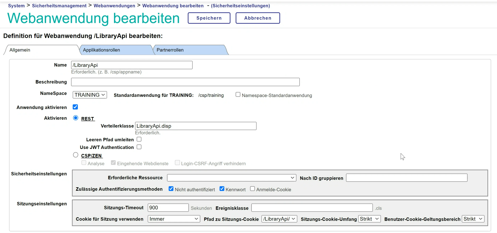

# Library API Backend

---

## Installation

1. Import the the [cls folder](./cls) into IRIS
2. Configure a new Webapplication in IRIS
   
3. Configure the user rights of the _UnknowUser_ to access the API unauthorized

---
